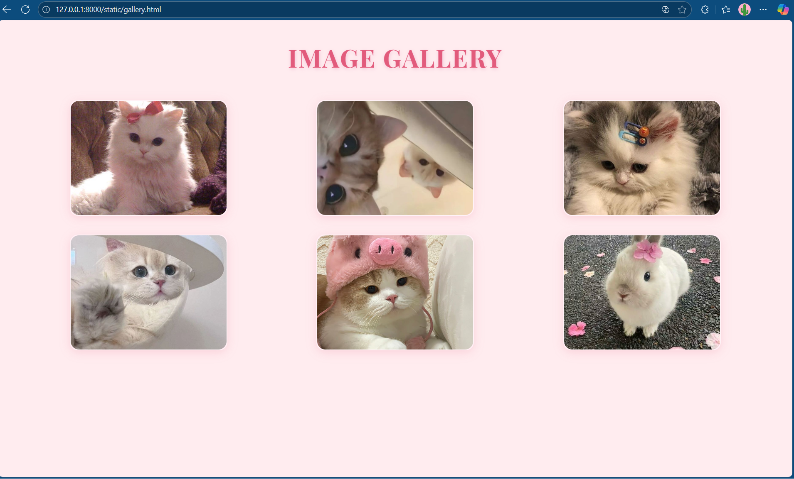
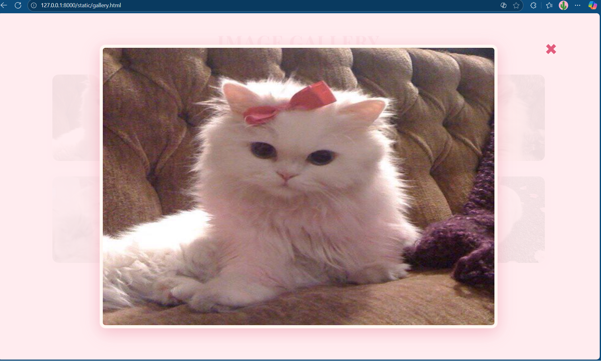
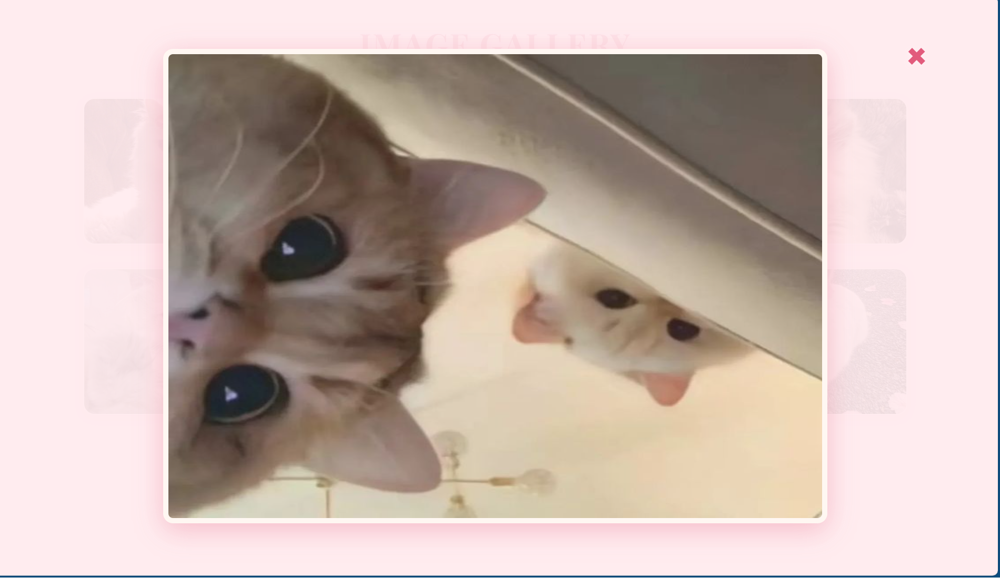
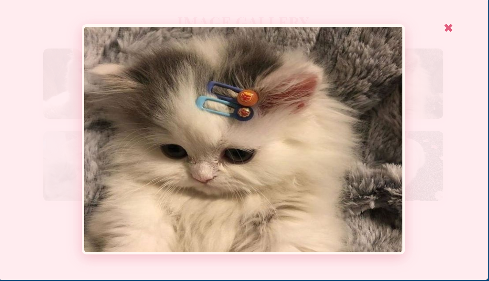
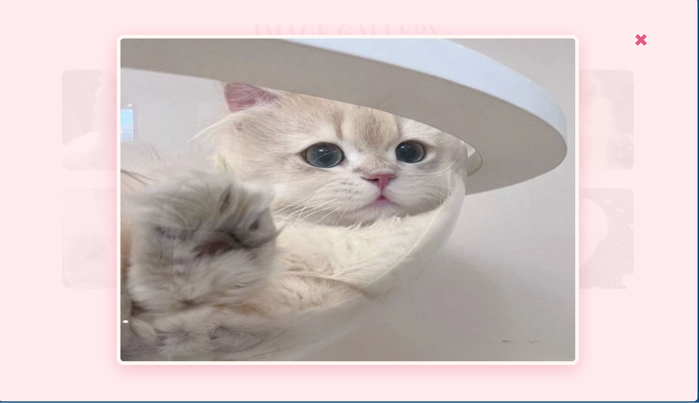
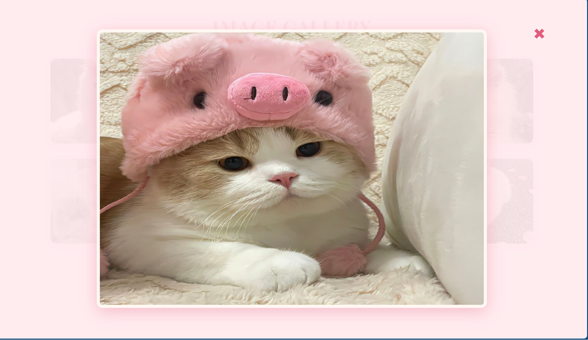
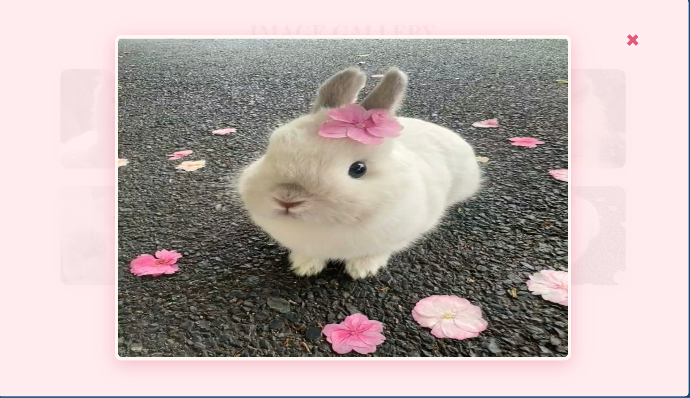

# Ex.08 Design of Interactive Image Gallery

## AIM
  To design a web application for an inteactive image gallery with minimum five images.

## DESIGN STEPS

## Step 1:

Clone the github repository and create Django admin interface

## Step 2:

Change settings.py file to allow request from all hosts.

## Step 3:

Use CSS for positioning and styling.

## Step 4:

Write JavaScript program for implementing interactivit

## Step 5:

Validate the HTML and CSS code

## Step 6:

Publish the website in the given URL.

## PROGRAM
gallery.html
```
<!DOCTYPE html>
<html lang="en">
<head>
  <meta charset="UTF-8" />
  <meta name="viewport" content="width=device-width, initial-scale=1.0" />
  <title>Image Gallery</title>
  <link rel="stylesheet" href="gallery.css" />
</head>
<body>
  <h1 class="title">IMAGE GALLERY</h1>
  <div class="gallery">
    <div class="card"></div>
    <div class="card"></div>
    <div class="card"></div>
    <div class="card"></div>
    <div class="card"></div>
    <div class="card"></div>
  </div>

  <div id="lightbox" class="lightbox">
    <span class="close">&times;</span>
    
  </div>

  <script src="gallery.js"></script>
</body>
</html>
```

gallery.css
```
@import url('https://fonts.googleapis.com/css2?family=Poppins:wght@300;400;600;700&family=Playfair+Display:wght@500;700&display=swap');

body {
    margin: 0;
    padding: 0;
    background: #ffecef;
    font-family: 'Poppins', sans-serif;
}

h1.title {
    text-align: center;
    font-size: 48px;
    color: #e25b7c;
    font-family: "Playfair Display", serif;
    margin-top: 40px;
    margin-bottom: 20px;
    letter-spacing: 2px;
    text-shadow: 1px 2px 8px #f3c4d6;
}

.gallery {
    display: grid;
    grid-template-columns: repeat(3, 1fr);
    grid-template-rows: repeat(2, 1fr);
    gap: 36px;
    justify-items: center;
    padding: 30px 70px;
}

.card {
    background: #ffe0ec;
    border-radius: 16px;
    box-shadow: 0 4px 18px rgba(226, 91, 124, 0.18);
    width: 300px;
    height: 220px;
    display: flex;
    align-items: center;
    justify-content: center;
    overflow: hidden;
    border: 2px solid #fff2f6;
    transition: box-shadow 0.2s, transform 0.2s;
    cursor: pointer;
}

.card:hover {
    transform: translateY(-8px) scale(1.03);
    box-shadow: 0 8px 28px rgba(226, 91, 124, 0.22);
}

.card img {
    width: 100%;
    height: 100%;
    object-fit: cover;
    border-radius: 16px;
    display: block;
}

.lightbox {
    position: fixed;
    top: 0;
    left: 0;
    width: 100vw;
    height: 100vh;
    background: rgba(255, 236, 239, 0.93); /* soft pink overlay */
    display: none;
    justify-content: center;
    align-items: center;
    z-index: 999;
    animation: fadeIn 0.4s;
}

.lightbox-content {
    width: 65vw;
    max-height: 80vh;
    border-radius: 15px;
    box-shadow: 0 10px 40px rgba(226, 91, 124, 0.32);
    animation: zoomIn 0.4s;
    background: #fff7f2;
    padding: 8px;
}

.close {
    position: absolute;
    top: 6%;
    right: 7%;
    font-size: 52px;
    color: #e25b7c;
    font-weight: bold;
    cursor: pointer;
    z-index: 1001;
    text-shadow: 0 2px 8px #fff2f6;
}

@keyframes fadeIn {
    from { opacity: 0; }
    to { opacity: 1; }
}

@keyframes zoomIn {
    from { transform: scale(0.7); opacity: 0; }
    to { transform: scale(1); opacity: 1; }
}
```

gallery.js
```

document.querySelectorAll('.card img').forEach(img => {
    img.addEventListener('click', function() {
        openLightbox(img.src);
    });
});

function openLightbox(src) {
    document.getElementById("lightbox-img").src = src;
    document.getElementById("lightbox").style.display = "flex";
}

document.querySelector('.lightbox .close').onclick = function() {
    document.getElementById("lightbox").style.display = "none";
};

document.getElementById("lightbox").addEventListener('click', function(e) {
    if (e.target === this) {
        this.style.display = "none";
    }
});
```

## OUTPUT










## RESULT
  The program for designing an interactive image gallery using HTML, CSS and JavaScript is executed successfully.
